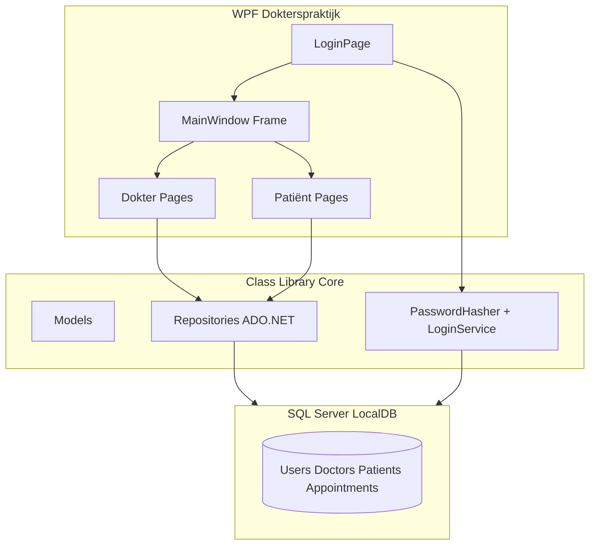
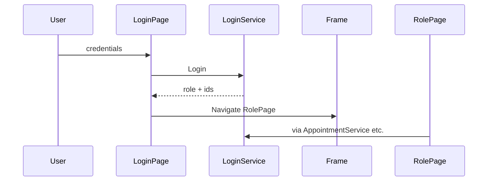

# Stappenplan: Dokterspraktijk OOAD-applicatie

## Uitgangspunt

| Item         | Keuze                                                                                                                      |
| ------------ | -------------------------------------------------------------------------------------------------------------------------- |
| Huidige code | Alleen lege WPF-starter in `[Dokterspraktijk](Dokterspraktijk)` — zie `[MainWindow.xaml](Dokterspraktijk/MainWindow.xaml)` |
| Database     | **Bestaande SQL Server / LocalDB** — al opgemaakt door jullie; wij **alleen verbinden**                                    |
| Schema       | Via **bestaand SQL-script** (SSMS); modellen/repositories laten we hierop aansluiten zodra script gedeeld is               |
| Data-access  | **SQL alleen in class library** (ADO.NET: `SqlConnection`, `SqlCommand`, parameters)                                       |
| AI-regels    | Volgen `[.github/AI-instructies.md](.github/AI-instructies.md)`; verboden technieken voeg je later toe                     |

---

## Fase 0 — Afspraken en AI-instructies (vóór code)

1. **Teamafspraken** vastleggen: wie doet class library, WPF-pages, connection string / testdata in bestaande DB.
2. `**[AI-instructies.md](.github/AI-instructies.md)` uitbreiden** met vaste regels (jij levert verboden technieken aan):
  - SQL/ADO.NET alleen in class library
  - Geen businesslogica in code-behind (alleen UI-events die services aanroepen)
  - Lijst “Verboden technieken” (Entity Framework, Dapper, hardcoded wachtwoorden, …) — stap voor stap aanvullen
3. **Git-werkflow**: feature branches per fase (login, dokter-CRUD, patiënt-afspraak, …).

---

## Fase 1 — Solution-structuur

1. Nieuw project `**Dokterspraktijk.Core`** (Class Library, `net10.0` of zelfde TF als WPF).
2. WPF-project `[Dokterspraktijk.csproj](Dokterspraktijk/Dokterspraktijk.csproj)` laat **project reference** naar Core.
3. `[SlnDokterspraktijk.slnx](SlnDokterspraktijk.slnx)` uitbreiden met Core-project.
4. Mappen in Core (voorbeeld):
  - `Models/` — `User`, `Doctor`, `Patient`, `Appointment`
  - `Data/` — connection helper, repositories
  - `Security/` — password hashing
  - `Services/` — login, afspraken, patiënt-CRUD (orchestratie boven repositories)

**WPF-structuur (later invullen):**

- `Views/LoginPage.xaml`
- `Views/Doctor/` — `AppointmentsPage`, `PatientsPage`, `PatientEditPage`, …
- `Views/Patient/` — `AppointmentsPage`, `BookAppointmentPage`, `ProfilePage`, …
- `[MainWindow.xaml](Dokterspraktijk/MainWindow.xaml)`: **één `Frame`** + eventueel menu/logout

---

## Fase 2 — Koppelen aan bestaande database (geen nieuw ontwerp)

**Jullie leveren:** het bestaande **SQL-script** (CREATE TABLE + eventuele seed) — bron in SSMS.

**Wij doen:**

1. **Script in repo** (optioneel maar handig): bijv. `Database/BestaandeDatabase.sql` — alleen ter referentie/docent; database zelf bestaat al.
2. **Schema in kaart brengen** — tabellen/kolommen uit script overnemen in Core-`Models` (geen verzonnen namen; exact zoals in jullie DB).
3. **Connection string** in WPF `App.config` (of `appsettings.json`):
  - `ConnectionStrings` → `DokterspraktijkDb`
  - Core: `DatabaseSettings` / `SqlConnectionFactory` leest die string; **geen** `SqlConnection` in WPF.
4. **Rooktest verbinding** — eenvoudige query in Core (bijv. `SELECT 1` of eerste login-tabel) vóór repositories bouwen.
5. **Wachtwoorden** — als de DB al users heeft: kolommen voor hash/salt controleren; `PasswordHasher.Verify` moet overeenkomen met hoe jullie (of de docent) hashes heeft opgeslagen. Nieuwe users alleen via app hashen volgens opdracht-eis.

**Niet in scope:** nieuwe EERD, `CreateDatabase.sql` vanaf nul, seed aanmaken (tenzij jullie testaccounts in de bestaande DB missen).

---

## Fase 3 — Class library: security en data-access

**Volgorde binnen Core:**

1. `**IDbConnectionFactory` / `SqlConnectionFactory`** — opent connecties met connection string uit config.
2. `**PasswordHasher**` — bijv. `Rfc2898DeriveBytes` (PBKDF2): hash + salt opslaan; `Verify(password, hash, salt)`.
3. `**UserRepository` + `LoginService**`
  - `Login(username, password)` → retourneert rol + ids (`DoctorId` / `PatientId`) of `null` bij fout.
4. **Repositories per domein** (allemaal parameterized SQL, geen string-concat voor user input):
  - `AppointmentRepository` — lijst per dokter/patiënt, insert, annuleren (status update)
  - `PatientRepository` — CRUD voor dokter
  - `ProfileRepository` — patiënt profiel lezen/bijwerken
5. **Services** (optioneel maar duidelijk voor OOAD):
  - `AppointmentService`, `PatientService` — validatie (datums in toekomst, verplichte velden) **hier**, niet in WPF.

**Regel:** WPF-projecten mogen alleen `Services`/`Models` gebruiken, nooit `System.Data.SqlClient` direct.

---

## Fase 4 — WPF-shell: login + Frame/Pages

1. `**MainWindow`**: `Frame` als hoofdnavigatie; `StartupUri` naar login of login als start-page in Frame.
2. `**LoginPage**` (één scherm voor beide rollen):
  - Username / password
  - Knop “Inloggen” → `LoginService` → bij succes:
    - Sla **ingelogde gebruiker** op (static `Session` of eenvoudige `AppState`-klasse in WPF)
    - `Frame.Navigate(new DoctorAppointmentsPage())` of `PatientAppointmentsPage()`
3. **Logout-knop** op dokter-/patiënt-pages → terug naar `LoginPage`, session leegmaken.
4. **Frame/Page-navigatie** voor subschermen:
  - Dokter: patiëntenlijst → `Navigate(new PatientEditPage(patientId))`
  - Patiënt: profiel, nieuwe afspraak als aparte `Page`-klassen

---

## Fase 5 — Dokter-functionaliteit

Per scherm een `Page` + code-behind die **alleen** services aanroept:

| Page                     | Functie                                                                                                    |
| ------------------------ | ---------------------------------------------------------------------------------------------------------- |
| `DoctorAppointmentsPage` | `ListBox`/`DataGrid` met afspraken; knop **Annuleren** → `AppointmentService.Cancel(id)` → lijst verversen |
| `DoctorPatientsPage`     | Overzicht patiënten; knoppen Nieuw / Bewerken / Verwijderen                                                |
| `DoctorPatientEditPage`  | CRUD-formulier (Create/Update); Delete met bevestiging                                                     |

**Dynamische UI (opdracht-eis):** patiëntenlijst of afsprakenlijst opbouwen in code-behind na `Load` — bijv. `foreach` over resultaat en `listBox.Items.Add(new ListBoxItem { ... })` of `ItemsSource` op een `List<AppointmentViewModel>` die je in code vult (geen statische 10 rijen in XAML).

---

## Fase 6 — Patiënt-functionaliteit

| Page                         | Functie                                                       |
| ---------------------------- | ------------------------------------------------------------- |
| `PatientAppointmentsPage`    | Eigen afspraken tonen                                         |
| `PatientBookAppointmentPage` | Datum/tijd + dokter kiezen → `AppointmentService.Create(...)` |
| `PatientProfilePage`         | Profiel laden; velden bewerken → `ProfileService.Update(...)` |

Zelfde patroon: laden bij `Loaded`, dynamisch vullen, foutmeldingen via `MessageBox` of `TextBlock` voor validatie.

---

## Fase 7 — Afronden en oplevering

1. **Foutafhandeling**: login fout, SQL-fouten → gebruiksvriendelijke boodschap (geen stack trace naar gebruiker).
2. **Handmatige testchecklist** (voor verslag/demo):

- Login dokter / patiënt / fout wachtwoord
- Dokter: afspraak annuleren, patiënt CRUD
- Patiënt: afspraak maken, profiel wijzigen
- Logout en opnieuw inloggen

1. **Documentatie** (indien gevraagd door vak): klassendiagram, ERD, screenshots per rol.
2. `**AI-instructies.md`** finaliseren met alle verboden technieken die de docent heeft opgegeven.

---

## Aanbevolen volgorde (kritisch pad)

```mermaid
gantt
  title Implementatievolgorde
  dateFormat X
  axisFormat %s
  section Basis
  Solution_plus_Core     :a1, 0, 1
  DB_connect_schema_map  :a2, 1, 2
  section Core
  Hashing_Login          :b1, 2, 3
  Appointment_repo       :b2, 3, 4
  Patient_CRUD_repo      :b3, 4, 5
  section WPF
  Login_Frame            :c1, 3, 4
  Doctor_pages           :c2, 5, 6
  Patient_pages          :c3, 6, 7
```

Werk **altijd** eerst de Core-laag (repository + test via kleine test-login) voordat je de bijbehorende Page bouwt — zo voorkom je dat UI en SQL door elkaar lopen.

---

## Status en volgende stap

- **Plan bijgewerkt:** database bestaat al → alleen koppelen + modellen op jullie script afstemmen.
- **Implementatie:** nog niet gestart (jouw keuze: eerst plan alleen).
- Geen keuze voor MVVM tenzij de docent dat verplicht — plan gebruikt **Page + code-behind** die services aanroept.

---

## Eerste concrete actie bij start implementatie

1. **SQL-script delen** (tabellen + kolomnamen voor login/rollen).
2. `Dokterspraktijk.Core` + project reference + `App.config` connection string + `SqlConnectionFactory` + rooktest.
3. `Models` + `UserRepository` / `LoginService` / `PasswordHasher` volgens **jullie** tabelstructuur.
4. `LoginPage` + `Frame` in `MainWindow`.

Daarna parallel: dokter-track en patiënt-track.

**Blokker voor Fase 3:** zonder SQL-script riskeren repositories verkeerde tabel-/kolomnamen; script eerst in repo of in chat plakken.